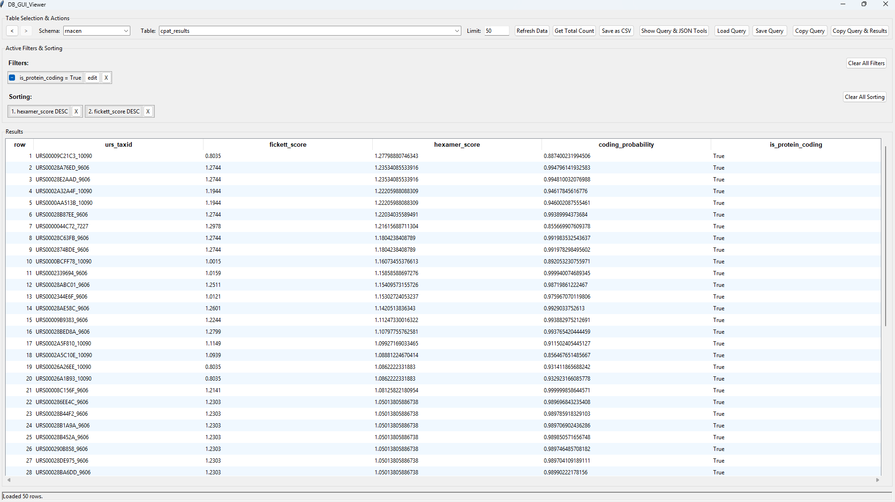

***

# PostgreSQL-Database-Viewer-GUI

A robust, lightweight, and user-friendly desktop application for viewing, querying, and analyzing PostgreSQL databases. Built with Python and Tkinter, it features advanced filtering, query history state management, and built-in JSON formatting tools.



## 🚀 Features

*   **Schema & Table Browser:** Automatically introspects schemas and tables.
*   **Fuzzy Table Search:** Quickly find tables across schemas using a fuzzy search combo box.
*   **Smart Grid:** Sortable columns and pagination (Limit/Offset logic).
*   **Advanced Filtering:** Visual filter builder supporting operators like `=`, `!=`, `ILIKE`, `IN`, `>`, `<`, etc.
*   **Query History & State:** Full **Undo/Redo** functionality. The app remembers your filters, sorting, and selected tables as you navigate.
*   **Save & Load Queries:** Save your current workspace configuration to JSON and reload it later.
*   **JSON Inspector:** Detects JSON data in cells; provides a formatted, syntax-highlighted view for complex objects.
*   **Manual SQL Mode:** Switch between GUI-driven exploration and writing custom raw SQL queries.
*   **Data Export:** Export current results to CSV.
*   **Demo Mode:** Includes built-in credentials for the EBI public bioinformatics database for testing.

## 📋 Prerequisites

*   **Python 3.10+**
*   **PostgreSQL** database access.

## 🛠️ Installation

1.  **Clone the repository** (or download the source code):
    ```bash
    git clone https://github.com/AnandJha123456789/PostgreSQL-Database-Viewer-GUI.git
    cd <your-repo-folder>
    ```

2.  **Create a Virtual Environment** (Recommended):
    ```bash
    # Windows
    python -m venv venv
    .\venv\Scripts\activate

    # macOS/Linux
    python3 -m venv venv
    source venv/bin/activate
    ```

3.  **Install Dependencies:**
    ```bash
    pip install -r requirements.txt

    # Linux users might need to install python3-tk
    sudo apt-get install python3-tk
    ```

## ⚙️ Configuration

The application uses a `.env` file to manage database credentials.

1.  Create a file named `.env` in the root directory.
2.  Add your database details:

```ini
DB_HOST=localhost
DB_PORT=5432
DB_NAME=your_database_name
DB_USER=your_username
DB_PASS=your_password
```

*Note: If no environment variables are found, the application may default to the Demo Config (EBI Public Database) defined in `src/config.py`.*

## ▶️ Usage

Run the application from the root directory using the module flag to ensure imports resolve correctly:

```bash
# Windows
python -m src.main

# macOS/Linux
python3 -m src.main
```

### Navigation Guide

1.  **Select Data:** Choose a **Schema** from the dropdown. Then, select or type to search for a **Table**.
2.  **Filtering:** Click any cell in the result grid to add a filter for that specific value/column.
3.  **Sorting:** Click column headers to toggle Ascending/Descending sort.
4.  **JSON Inspection:** Middle-click (or double-right-click) on a cell containing JSON data to open the Inspector / Formatter tool.
5.  **Custom Queries:** Click "Show Query & JSON Tools" to see the generated SQL. You can edit this manually and click "Run Custom Query".
6.  **History:** Use the `<` and `>` buttons in the top left to move backward and forward through your exploration history.

## 📂 Project Structure

```text
db_viewer/
├── assets/                 # Images for README (screenshots)
├── src/
│   ├── __init__.py         # Marks directory as a Python package
│   ├── main.py             # The entry point; initializes the app and logging
│   ├── config.py           # Handles database configuration and defaults
│   ├── database.py         # Pure backend logic (connection, querying, threading)
│   ├── models.py           # Data classes defining Filters and Sort logic
│   ├── utils.py            # Helper functions (logging setup, etc.)
│   └── ui/                 # User Interface logic
│       ├── __init__.py
│       ├── app.py          # The main TKinter GUI class (Layout, Events)
│       ├── components.py   # Reusable widgets (e.g., FlowFrame)
│       └── styles.py       # Visual styling configuration
├── requirements.txt        # List of Python dependencies
└── README.md               # Documentation
```

## 🐛 Troubleshooting

*   **"CRITICAL ERROR: The required library 'pg8000' is not installed"**:
    Ensure you activated your virtual environment and ran `pip install -r requirements.txt`.
*   **Connection Failed**:
    Check your `.env` file details. Ensure your PostgreSQL server is running and accepts connections from your IP.
*   **UI Freezing**:
    The app uses threading for data fetching. If the UI hangs specifically during "Get Total Count" on a massive table, the database might be taking a long time to return the count.

## 📄 License

Distributed under the MIT License. See `LICENSE` for more information.